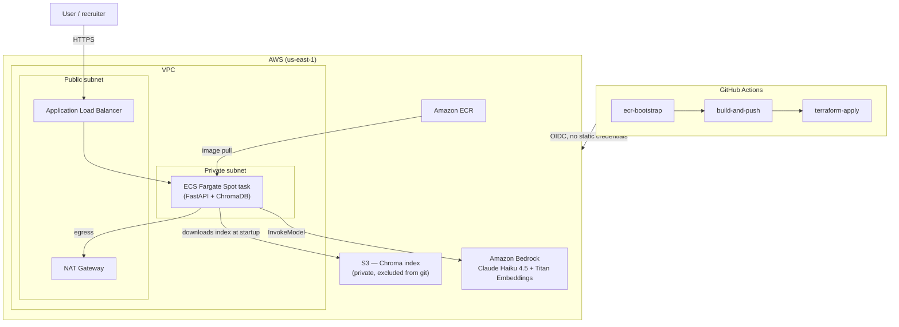

# rag-api-cloud

A production-style RAG (Retrieval-Augmented Generation) API deployed on AWS. FastAPI serving retrieval + generation over Amazon Bedrock (Claude Haiku 4.5 + Titan Embeddings), containerized with Docker, provisioned entirely with Terraform, and deployed through a GitHub Actions pipeline authenticated via OIDC (no long-lived AWS credentials anywhere).

This is the second project in a four-part portfolio series. [`local-rag-second-brain`](https://github.com/cd-aguilar/local-rag-second-brain) built the RAG pipeline itself, 100% local (Ollama + ChromaDB). This project takes that pipeline and answers a different question: **what does it take to run it as a real, internet-facing service?**

## Live demo

Infrastructure is deployed on demand, not left running 24/7 — a NAT Gateway + ALB + Fargate stack costing money while idle isn't a good tradeoff for a portfolio project. See [Deploying](#deploying) to spin it up yourself, or check the `Actions` tab for the most recent successful `Deploy` run, which prints the live URL in its job summary.

```bash
curl -X POST http://<demo-url>/query \
  -H "Content-Type: application/json" \
  -H "X-API-Key: <your-key>" \
  -d '{"question": "What stack does the segundo-cerebro-RAG project use?", "top_k": 4}'
```

```json
{
  "answer": "According to the Segundo Cerebro RAG — Architecture document, the stack is:\n1. Obsidian Vault (.md)...",
  "sources": [
    "02-Proyectos/segundo-cerebro-RAG/ARCHITECTURE.md",
    "02-Proyectos/segundo-cerebro-RAG/README.md"
  ],
  "retrieval_score": 0.314,
  "tokens_used": 1246,
  "latency_ms": 5938.4
}
```

## Architecture



**Why this shape, not something simpler:**
- **ECS Fargate over Lambda** — the target audience for this repo is Cloud/DevOps interviewers. Fargate exercises VPC design, load balancing, and container orchestration; Lambda would demonstrate less of that surface area, and 12k+ vector chunks don't fit comfortably in a stateless function anyway.
- **Ephemeral infrastructure, not always-on** — `deploy.yml` and `teardown.yml` are both manual (`workflow_dispatch`). The NAT Gateway and ALB are the two components that actually cost money while idle; keeping them off by default keeps this project at effectively $0/month except during active demos.
- **Bedrock over self-hosted Ollama for this deployment** — `rag-second-brain` already proves self-hosted inference works. This project proves the opposite skill: integrating managed AI services in a cloud-native pipeline, which is what most AI/Cloud Engineer roles actually ask for.

## Stack

| Layer | Technology |
|---|---|
| API | FastAPI, Python 3.12 |
| LLM / Embeddings | Amazon Bedrock (Claude Haiku 4.5, Titan Embeddings V2) |
| Vector store | ChromaDB (persisted, synced from S3 at container startup) |
| Container | Docker (multi-stage, non-root, healthcheck) |
| Infrastructure | Terraform (VPC, ALB, ECS Fargate, IAM, ECR, S3) |
| CI/CD | GitHub Actions, OIDC federation to AWS (zero stored credentials) |
| Compute | ECS Fargate Spot (cost optimization for a fault-tolerant demo workload) |

## API

| Method | Path | Description |
|---|---|---|
| `GET` | `/health` | Liveness check, polled by the ALB target group |
| `POST` | `/query` | Ask a question; returns answer, cited sources, retrieval score, token usage, latency |
| `GET` | `/metrics` | In-memory LLMOps counters (query volume, token usage, average latency) |
| `GET` | `/docs` | Interactive Swagger UI |

## Running locally

Requires Docker Desktop and an AWS account with Bedrock model access enabled for Claude Haiku 4.5 and Titan Embeddings V2.

```bash
git clone https://github.com/cd-aguilar/rag-api-cloud.git
cd rag-api-cloud
python -m venv .venv && .venv\Scripts\Activate.ps1   # Windows; use source .venv/bin/activate on macOS/Linux
pip install -r scripts/requirements.txt

# Build the Chroma index from an Obsidian vault (or any folder of markdown notes)
python scripts/reindex.py /path/to/your/vault

# Run the API
docker compose up --build
curl http://localhost:8000/health
```

`docker-compose.yml` mounts `./data/chroma` and `~/.aws` read-only, so the container authenticates to Bedrock with your local AWS CLI credentials — no keys hardcoded anywhere.

## Deploying

1. **Bootstrap the Terraform backend** (one-time, per AWS account):
   ```bash
   aws s3api create-bucket --bucket <your-bucket> --region us-east-1
   aws s3api put-bucket-versioning --bucket <your-bucket> --versioning-configuration Status=Enabled
   aws dynamodb create-table --table-name <your-lock-table> \
     --attribute-definitions AttributeName=LockID,AttributeType=S \
     --key-schema AttributeName=LockID,KeyType=HASH --billing-mode PAY_PER_REQUEST
   ```
2. **Create an OIDC identity provider + IAM role** in AWS IAM trusting `token.actions.githubusercontent.com`, scoped to this repository.
3. **Add repository secrets**: `AWS_ROLE_ARN`, `TF_STATE_BUCKET`, `TF_LOCK_TABLE`.
4. **Run the `Deploy` workflow** from the Actions tab. It builds the image, creates all infrastructure, and prints the live URL in the job summary.
5. **Upload the Chroma index** (never committed to git — see below):
   ```bash
   aws s3 sync data/chroma s3://<chroma-bucket-from-terraform-output>/chroma-data/
   aws ecs update-service --cluster rag-api-cloud-cluster --service rag-api-cloud-service --force-new-deployment
   ```
6. **Run the `Teardown` workflow** when done, to return to ~$0/month.

## Design decisions worth calling out

**The Chroma index never touches git or the Docker image.** The `.gitignore` excludes `data/` because it contains embeddings derived from private notes. Instead, the index is synced to a private S3 bucket by hand, and the container downloads it from S3 at startup using its IAM task role — no static credentials, and no private data in a public repository's history.

**A 3-stage CI/CD pipeline (`ecr-bootstrap` → `build-and-push` → `terraform-apply`), not 2.** The first version of this pipeline tried to `docker push` before the ECR repository existed, since Terraform (which owns ECR) ran *after* the build step. Rather than patch around it with ad-hoc AWS CLI calls and `terraform import` (which proved fragile — import can fail silently in CI), the repository is now created by a small, targeted Terraform apply as its own job, before anything else runs.

**Least-privilege IAM, split into execution vs. task roles.** The ECS execution role (used by the ECS agent to pull images and write logs) is separate from the task role (used by application code to call Bedrock and read from S3). Neither can do the other's job.

**GitHub's OIDC `sub` claim includes immutable org/repo IDs**, e.g. `repo:org@111643900/repo@1309982658:ref:refs/heads/main`, not just `repo:org/repo:*`. The IAM trust policy condition has to account for this with a wildcard pattern (`repo:org@*/repo@*:*`) — a change GitHub rolled out that isn't obvious from the AWS documentation, and cost real debugging time via CloudTrail before the root cause surfaced.

## Roadmap

- [ ] Evaluation with [RAGAS](https://github.com/explodinggradients/ragas) (faithfulness, context precision/recall) — replacing the current ad-hoc retrieval score with industry-standard metrics
- [ ] HTTPS on the ALB via ACM + a subdomain
- [ ] Least-privilege IAM policy for the OIDC deploy role (currently `AdministratorAccess`, scoped down)

## Related projects

Part of a four-project portfolio series covering AI, Cloud, Automation, and Security:

1. [`local-rag-second-brain`](https://github.com/cd-aguilar/local-rag-second-brain) — local-first RAG fundamentals
2. **`rag-api-cloud`** (this repo) — Cloud/DevOps
3. [`ai-agent-mcp-automation`](https://github.com/cd-aguilar/ai-agent-mcp-automation) — AI agents, MCP, n8n
4. [`blue-team-detection-lab`](https://github.com/cd-aguilar/blue-team-detection-lab) — Detection engineering, MITRE ATT&CK

## License

MIT
